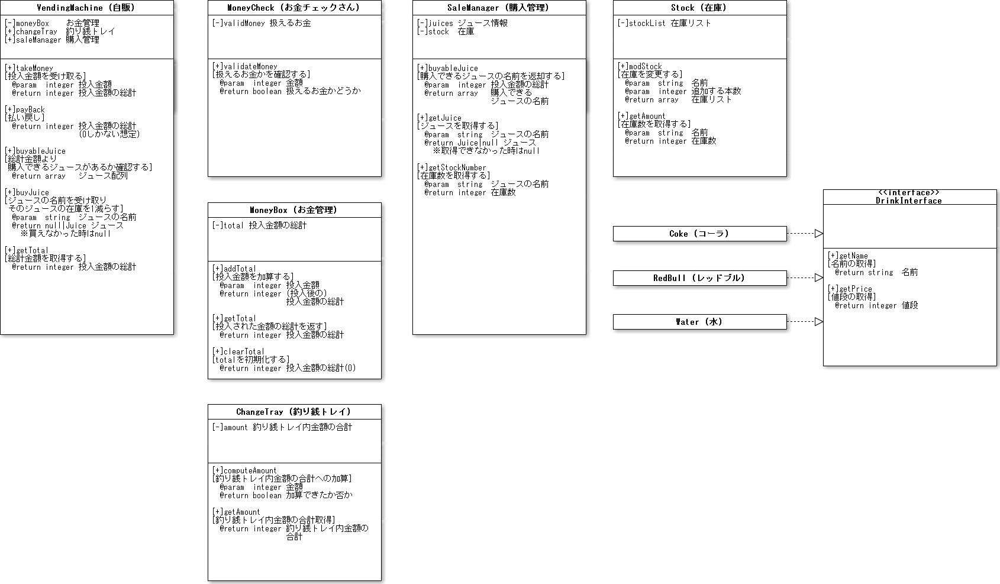

#概要
飲み物自動販売機を作る  

#機能
##お金の投入と払い戻し
- 10円玉、50円玉、100円玉、500円玉、1000円札を１つずつ投入できる。
    - [明記] 1回につき1金種1つ。10円玉と100円玉を一緒に入れたりはできない。
- 投入は複数回できる。
- 投入金額の総計を取得できる。
- 払い戻し操作を行うと、投入金額の総計を釣り銭として出力する。
    - [明記] その時入っている投入金額の総計が返却される。

##扱えないお金
- 想定外のもの（硬貨：１円玉、５円玉。お札：千円札以外のお札）が投入された場合は、投入金額に加算せず、それをそのまま釣り銭としてユーザに出力する。
    - [明記] 投入された後、すぐにトレイに返却される。

##ジュースの管理
- 値段と名前の属性からなるジュースを１種類格納できる。初期状態で、コーラ（値段:120円、名前”コーラ”）を5本格納している。
- 格納されているジュースの情報（値段と名前と在庫）を取得できる。
- ※注意：責務を持ちすぎていませんか？責任を持ちすぎていたら分割しましょう

##購入
- 投入金額、在庫の点で、コーラが購入できるかどうかを取得できる。
- ジュース値段以上の投入金額が投入されている条件下で購入操作を行うと、ジュースの在庫を減らし、売り上げ金額を増やす。
- 投入金額が足りない場合もしくは在庫がない場合、購入操作を行っても何もしない。
- 現在の売上金額を取得できる。
- 払い戻し操作では現在の投入金額からジュース購入金額を引いた釣り銭を出力する。
- ※注意：責務が集中していませんか？責務が多すぎると思ったら分けてみましょう

##機能拡張
- ジュースを3種類管理できるようにする。
    - 在庫にレッドブル（値段:200円、名前”レッドブル”）5本を追加する。
    - 在庫に水（値段:100円、名前”水”）5本を追加する。
- 投入金額、在庫の点で購入可能なドリンクのリストを取得できる。

----
今ここまで
----

##釣り銭と売り上げ管理
- ジュース値段以上の投入金額が投入されている条件下で購入操作を行うと、釣り銭（投入金額とジュース値段の差分）を出力する。
    - ジュースと投入金額が同じ場合、つまり、釣り銭0円の場合も、釣り銭0円と出力する。
    - 釣り銭の硬貨の種類は考慮しなくてよい。

#参考資料
http://devtesting.jp/tddbc/?TDDBC%E5%A4%A7%E9%98%AA3.0%2F%E8%AA%B2%E9%A1%8C

----

#クラス図

# ユースケース図

